<div align="center">

<!-- Dynamic Typing Header -->
[](https://git.io/typing-svg)


<!-- Profile Views Counter -->


</div>

---

## 🧠 About Me


```python
class AnshikaMishra:
    def __init__(self):
        self.name       = "Anshika Mishra"
        self.username   = "10anshika"
        self.university = "Pantech University"
        self.role       = "Aspiring AI/ML Engineer"
        self.tagline    = "Exploring patterns in data and building"
                          " intelligent systems that create real-world impact."

    @property
    def interests(self):
        return [
            "🤖 Machine Learning & Deep Learning",
            "🧬 Natural Language Processing",
            "👁️  Computer Vision",
            "⛓️  Blockchain & Web3",
            "📊 Data Science & Analytics",
            "🚀 Generative AI & LLMs",
        ]

    @property
    def currently_learning(self):
        return [
            "Advanced ML Algorithms",
            "Generative AI & LLM Fine-tuning",
            "MLOps & Model Deployment",
            "AI Agents & Agentic Workflows",
        ]

    def life_motto(self):
        return "Build → Break → Learn → Repeat 🔁"
```

<br clear="right"/>

---

## 🎯 Current Focus

<div align="center">

| 🔭 Working On | 🌱 Learning | 👯 Looking to Collaborate | 💬 Ask Me About |
|:---:|:---:|:---:|:---:|
| AI/ML Projects & DApps | Generative AI & MLOps | Open Source AI Projects | Python, ML, Deep Learning |

</div>

---

## 🛠️ Tech Stack & Tools

<div align="center">

### 💻 Programming Languages


### 🤖 AI / ML / Data Science


### ⚙️ Tools & Platforms


### 🌐 Exploring


</div>

---

## 🚀 Featured Projects

<div align="center">

<table>
<tr>
<td width="50%" valign="top">

### ⛓️ Blockchain Micro-Insurance DApp
  

> A blockchain-powered micro-insurance platform on **Aptos** targeting underserved populations earning $2–5/day — bringing financial protection to the unbanked.

**✨ Key Features:**
- 📜 Smart contract-based policy issuance
- 💸 Automated, trustless claim payouts
- 🗳️ Community governance model
- 🔍 Fully transparent claims processing

</td>
<td width="50%" valign="top">

### 🤖 Samadhan-AI
  

> An intelligent **bureaucracy navigator** that helps citizens efficiently access government services — reducing friction for millions who struggle with complex administrative systems.

**✨ Key Features:**
- 🗣️ Conversational AI interface
- 📋 Step-by-step service guidance
- 🌐 Multi-language support
- 📍 Scheme discovery & eligibility check

</td>
</tr>

<tr>
<td width="50%" valign="top">

### ❤️ Heart Disease Prediction Model
  

> ML pipeline for predicting **cardiovascular disease risk** using clinical healthcare data — enabling early intervention and preventive care.

**✨ Key Features:**
- 📊 Feature engineering on clinical data
- 🧪 Multiple model comparison & evaluation
- 📈 Risk scoring & probability output
- 🏥 Healthcare-grade data preprocessing

</td>
<td width="50%" valign="top">

### 🌸 RituCare
  

> An AI-driven **healthcare and prediction platform** focused on personalized wellness — combining intelligent diagnostics with actionable health insights.

**✨ Key Features:**
- 🔬 Predictive health analytics
- 💊 Personalized recommendation engine
- 📱 User-friendly health interface
- 🧠 AI-powered health monitoring

</td>
</tr>
</table>

</div>

---

## 📊 GitHub Analytics

<div align="center">


</div>

<div align="center">

[](https://git.io/streak-stats)

</div>

---

## 🏆 GitHub Trophies

<div align="center">

[](https://github.com/ryo-ma/github-profile-trophy)

</div>

---

## 📈 Contribution Activity

<div align="center">

[](https://github.com/ashutosh00710/github-readme-activity-graph)

</div>

---

## 🐍 Contribution Snake

<div align="center">

<picture>
  <source media="(prefers-color-scheme: dark)" srcset="https://raw.githubusercontent.com/10anshika/10anshika/output/github-contribution-grid-snake-dark.svg"/>
  <source media="(prefers-color-scheme: light)" srcset="https://raw.githubusercontent.com/10anshika/10anshika/output/github-contribution-grid-snake.svg"/>
  
</picture>

</div>

---

## 🗺️ Learning Roadmap 2025

```mermaid
graph LR
    A[✅ Python & ML Fundamentals] --> B[✅ Deep Learning & TensorFlow]
    B --> C[🔄 Advanced ML & Feature Engineering]
    C --> D[🔄 Generative AI & LLMs]
    D --> E[📅 MLOps & Model Deployment]
    E --> F[📅 AI Agents & Agentic Workflows]
    F --> G[🎯 Production AI Systems]

    style A fill:#2d6a4f,color:#fff
    style B fill:#2d6a4f,color:#fff
    style C fill:#6E40C9,color:#fff
    style D fill:#6E40C9,color:#fff
    style E fill:#1a1a2e,color:#aaa
    style F fill:#1a1a2e,color:#aaa
    style G fill:#c77dff,color:#fff
```

<div align="center">



| Status | Meaning |
|:---:|:---|
| ✅ Green | Completed |
| 🔄 Purple | Currently Learning |
| 📅 Dark | Upcoming |
| 🎯 Violet | Goal |

</div>

---

## 🌟 What I'm Up To

- 🔭 **Building:** AI-powered applications that solve real-world problems
- 🌱 **Learning:** Generative AI, MLOps, LLM fine-tuning, and AI Agents
- 🤝 **Open to:** Research collaborations, open-source contributions, internships
- 💡 **Passionate about:** Making AI accessible and impactful for underserved communities
- 🏆 **Goal:** Contribute to cutting-edge AI research and build products that matter

---

## 💡 Fun Facts

<div align="center">

| 🎯 | Detail |
|:---:|:---|
| ⚡ | I debug faster with lo-fi music in the background |
| 🧩 | I see every dataset as a puzzle waiting to be solved |
| 🌏 | I believe AI can solve some of humanity's biggest challenges |
| ☕ | My model accuracy improves with caffeine input (correlation ≈ 1.0) |
| 📚 | I read research papers like others read novels |
| 🚀 | Favorite quote: *"The best way to predict the future is to create it"* |

</div>

---

## 📬 Connect With Me

<div align="center">

[](https://github.com/10anshika)
[](https://linkedin.com/in/anshika-mishra)
[](mailto:your-email@example.com)
[](https://kaggle.com/anshikamishra)
[](https://twitter.com/anshikamishra)

</div>

---

<div align="center">

### 💬 Quote That Drives Me

> *"Exploring patterns in data and building intelligent systems that create real-world impact."*
>
> — Anshika Mishra

<br/>

**✨ If you find my work interesting, a ⭐ on any repo means the world to me! ✨**


</div>
